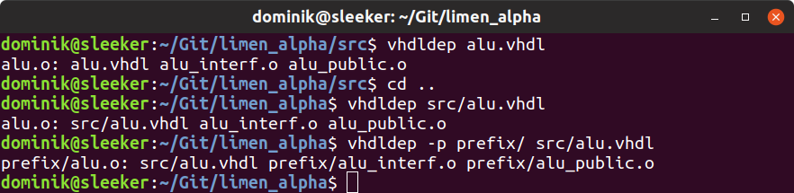

**If you have GitPack 0.7.0 and lower, please visit [this discussion](https://github.com/dominiksalvet/gitpack/discussions/10).**

---

# vhdldep

[](https://github.com/dominiksalvet/vhdldep/commits)
[](https://github.com/topics/gitpack)
[](https://github.com/RichardLitt/standard-readme)
[](https://hits.seeyoufarm.com)

> Simple VHDL dependency generator.

The development of VHDL projects very often involves building multiple VHDL files. Based on designed architecture, some files must be built before others. That might cause problems with finding the correct build order. And that is exactly where vhdldep comes in handy.

Vhdldep analyzes use statements of given VHDL files and returns their **file dependencies in a makefile format**. That output can be easily used to determine the correct build order to help automate building VHDL projects.

## Install

Vhdldep uses [GitPack](https://github.com/dominiksalvet/gitpack). Local installation/update:

```sh
gitpack install github.com/dominiksalvet/vhdldep
```

## Usage

Get **VHDL file dependencies**:

```
vhdldep <file>
```

With **custom prefix** for generated paths:

```
vhdldep -p <prefix> <file>
```

### Example

<p align="center">
    
</p>

The *alu.vhdl* file has been borrowed from the [Limen Alpha](https://github.com/dominiksalvet/limen-alpha) processor.

## Contributing

Do you want to contribute? Do you have any questions? Then the [*CONTRIBUTING.md*](CONTRIBUTING.md) file is here for you.

## License

This project is licensed under the [MIT License](LICENSE).
